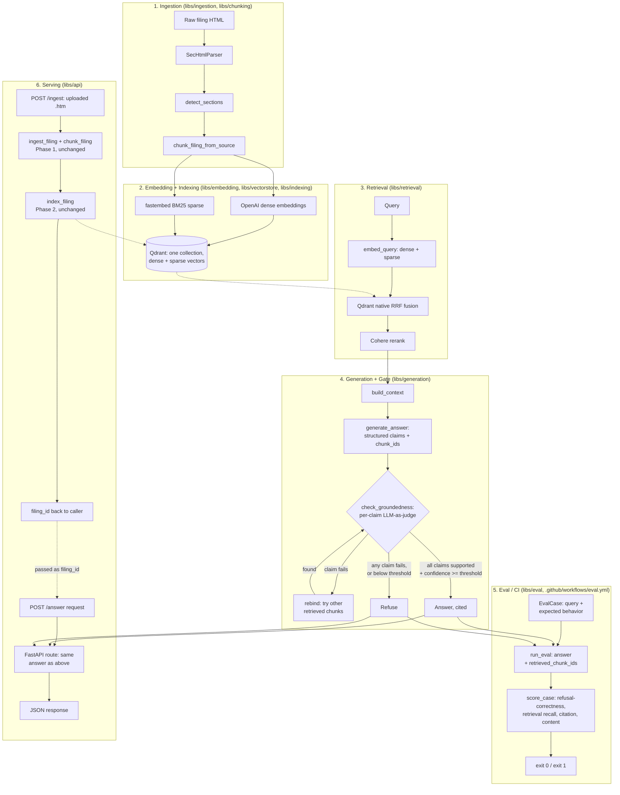

# Architecture

CiteOrRefuse is six layers, each built and tested independently before the
next one was built on top of it. No layer assumes the one below it is
perfect — the ingestion layer was hardened against four real filings before
embedding started, and the generation layer's groundedness gate exists
specifically because retrieval is expected to sometimes surface plausible
but wrong content, not because it's expected to be perfect.

## 1. Ingestion — `libs/ingestion`, `libs/chunking`

`SecHtmlParser` turns raw EDGAR HTML into an ordered list of `Block`s (text
or table), deliberately not trying to detect headings by tag — real filings
mark section headings with bold/underline styling, not semantic `<h1>`-`<h6>`
tags, or even lay them out inside single-row tables for pixel alignment.
`detect_sections` pattern-matches `Item N` headings across those blocks into
`Section`s with a `part` (I–IV). `chunk_filing_from_source` then packs each
section's text into ~400-600 token chunks via `tiktoken`, and chunks tables
row-group-wise, guaranteeing a chunk boundary never falls mid-row.

Every design choice here exists because of a specific real bug found
running the pipeline against a real filing — see the README's bug list.

## 2. Embedding + Indexing — `libs/embedding`, `libs/vectorstore`, `libs/indexing`

Each chunk is embedded twice: dense via OpenAI (`text-embedding-3-small`),
sparse via `fastembed`'s BM25 implementation (not hand-rolled — same
reasoning throughout this project: don't reimplement well-tested retrieval
math). Both vectors land in one Qdrant collection per point, not two
separate systems, with a deterministic point ID (`uuid5` of the chunk's own
`chunk_id`) so re-indexing an already-indexed filing overwrites rather than
duplicates. Every point's payload carries everything needed to reconstruct
a citation on its own — company, form type, filing date, Part, Item, section
title, char offsets, and the chunk's full text — so a retrieved point never
needs a second lookup to become a citation.

## 3. Retrieval — `libs/retrieval`

A query is embedded the same two ways (dense + sparse), but *without* the
context-header prefix chunks get at index time — a query is already
semantically complete; the header exists to anchor otherwise-bare chunk
content (like a table of numbers) topically, which a query doesn't need.
Qdrant's native reciprocal rank fusion (`prefetch` + `FusionQuery`) merges
the two branches — not a hand-rolled fusion implementation. The fused
candidates then go through Cohere Rerank, which reads actual content rather
than just rank position; see the README for a specific, measured example of
why that step earns its place in the pipeline rather than just re-sorting
what fusion already had right.

## 4. Generation + Groundedness Gate — `libs/generation`

Retrieved chunks are formatted into a context block tagged by `chunk_id`,
sent to the LLM with instructions to answer using *only* that context and
attribute every claim to a specific `chunk_id`. `check_groundedness` then
verifies each claim in two stages: first mechanically (is the cited
`chunk_id` even among what was retrieved — catches a hallucinated
reference with no LLM call needed), then semantically (does the cited
chunk's actual text support the claim, via a second LLM-as-judge call). If
a claim fails the semantic check, `check_groundedness` searches the *other*
already-retrieved chunks for one that does support it before giving up —
never inventing new sources, only correcting which already-retrieved one a
claim is attributed to. `overall_confidence` is the *minimum* across
claims, not an average: one unsupported claim sinks the whole answer.
Anything short of "all claims supported, confidence above threshold"
refuses, with a stated reason, rather than returning a partial or
hedged guess.

## 5. Eval / CI — `libs/eval`, `.github/workflows/eval.yml`

`EvalCase`s (query + expected behavior, optionally expected citations and
answer content) get run through the real `answer()` pipeline once per
case; `AnswerResult.retrieved_chunk_ids` gives `score_case` the raw
top-K retrieved chunk_ids without a second `retrieve()` call (an earlier
version called `retrieve()` separately for this, which silently doubled
the Cohere rerank calls made per case and caused real rate-limit failures
against Cohere's trial tier — see the README). `score_case` checks four
independent things — did it answer/refuse correctly, was the expected
chunk actually retrieved, was it actually cited, did the answer contain
the expected content — and `scripts/run_eval.py` exits non-zero if any
case fails. The GitHub Actions workflow is `workflow_dispatch`-only
(manually triggered, not on every PR) — see the README for why, and for
the current honest limitations of this layer.

## 6. Serving — `libs/api`

A thin FastAPI wrapper: `POST /answer` takes a query (and optional
`top_k`/`filing_id`), resolves the same OpenAI/Qdrant/fastembed/Cohere
clients every script above constructs, and calls the same `answer()`
function — `AnswerResult` is returned directly as the JSON response, no
separate API schema duplicating its shape. Clients are `lru_cache`-backed
singletons wired through FastAPI's dependency injection
(`libs/api/dependencies.py`), each independently overridable in tests, so
route tests never need real API keys, the same guarantee every other
layer's tests already have. The in-memory Qdrant collection is indexed
with the same 4 fixture filings `scripts/run_eval.py` uses
(`libs/indexing/fixtures.py`) lazily, on the first request.

`POST /ingest` (Phase 7) is a real upload path onto that same collection:
it writes the uploaded bytes to a temp file, builds a `Filing` with
`form_type="10-K"` fixed (never taken from the request), and calls Phase
1's `ingest_filing()` + `chunk_filing()` and Phase 2's `index_filing()`
directly — no new pipeline logic, just a new entry point. The existing
`UnsupportedDocumentTypeError` guard (see section 1) does real work here:
a non-10-K upload is rejected with a specific, human-readable 422, not a
crash or a plausible-looking wrong answer built on a section structure
the detector wasn't designed for. Two guardrails specific to this
endpoint: a byte-capped read (`ingest_settings.max_upload_bytes`, checked
before parsing even starts) and a fixed-window per-client rate limit
(`libs/api/rate_limit.py`) — deliberately only on `/ingest`, since it's
the expensive (real embedding calls) and abusable operation, unlike
`/answer` against already-indexed content.

An uploaded filing is session-scoped by construction, not by an actual
session/auth mechanism: `/answer` defaults to searching only the 4 baked-
in fixture filing_ids (`_FIXTURE_FILING_IDS` in `libs/api/app.py`) unless
the caller explicitly passes back the `filing_id` `/ingest` returned. The
core `retrieve()`/`hybrid_search()` functions gained an optional
`filing_ids` filter to make this possible (a Qdrant payload filter on
`filing_id`) — off by default, so every pre-Phase-7 caller of
`retrieve()`/`answer()` is unaffected. There is no frontend; FastAPI's
`/docs` Swagger UI, curl, or direct Python calls are the only interfaces.

See the README for this layer's other current limitations (no auth, no
persistent storage, no PDF support, synchronous request handling).

## Data storage: why no Postgres or S3

The original spec (`project_idea.txt`) named PostgreSQL for metadata and
S3 for document storage. Both were deliberately not built — a closed
decision, not an oversight or an open question:

- **Postgres** would have stored per-chunk metadata for lookup alongside
  the vector index. That need is already met: every Qdrant point's
  payload carries company, form type, filing date, Part, Item, section
  title, char offsets, and the chunk's own text (section 2) — a citation
  is reconstructed from the same query that retrieved it, no second
  lookup, no second system to keep in sync. The one thing that *would*
  justify Postgres is a genuine query-log/audit-trail feature (a
  persisted record of who asked what and which citation came back) — but
  no such feature exists anywhere in this project today, in the API or
  otherwise, so there is currently nothing concrete pulling it back in.
  If an audit trail becomes an actual requirement, that's the trigger to
  revisit this, not "metadata" in the abstract.
- **S3** would only matter once persistence across process restarts is
  itself a goal. It deliberately isn't, at this project's scale: Qdrant
  runs `:memory:` only, fixture filings re-index on every process start,
  and `POST /ingest` uploads are never written anywhere durable (see the
  README's serving-layer limitations). S3 without that persistence goal
  would have nothing to actually persist.
